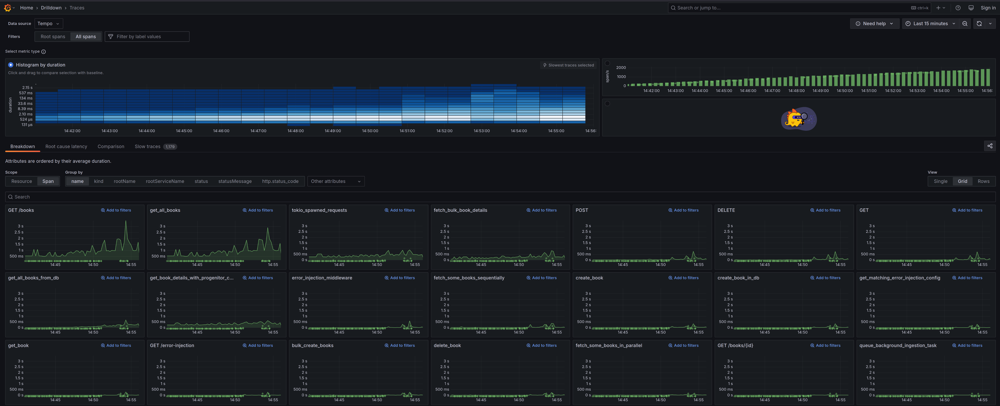

# Rust Telemetry & Observability Example

This repository provides a comprehensive example of cross-service telemetry and observability in a distributed Rust application. It demonstrates how to effectively implement the three pillars of observability—traces, metrics, and logs—using OpenTelemetry and the Rust ecosystem.

The project is a multi-service "Book App" designed to showcase how to trace requests as they flow through REST APIs, asynchronous message queues (Kafka), and database interactions.

## Architecture

The system consists of two Rust services, a PostgreSQL database, and a Kafka message queue. All telemetry data is collected by the OpenTelemetry Collector and visualized using Grafana, Loki, Tempo, and Prometheus. Sentry is integrated for advanced error tracking and is correlated with the OpenTelemetry traces.


### Service and Data Flow


### Observability Pipeline


## Key Features

This repository demonstrates several production-ready observability patterns:

- **Distributed Tracing**: End-to-end tracing across multiple services and protocols:
    - **HTTP**: The `axum` web framework is instrumented to create and propagate trace context.
    - **Database**: `sqlx` database calls are traced to monitor query performance.
    - **Generated Client**: An OpenAPI-generated progenitor client is instrumented to propagate context automatically.
    - **Message Queue (Kafka)**: Trace context is injected into Kafka message headers and used to create linked spans in the consumer, correctly modeling the asynchronous workflow.

- **Sentry & OpenTelemetry Correlation**: A custom `SentryOtelCorrelationLayer` bridges the gap between Sentry error tracking and OpenTelemetry tracing. When an error is sent to Sentry, it is automatically tagged with the `otel.trace_id` and `otel.span_id`. This allows you to jump directly from a Sentry issue to the corresponding distributed trace in Grafana/Tempo for immediate context.
- **Logs with Trace Context**: Application logs are exported via the OpenTelemetry Collector and are automatically correlated with traces, making it easy to find logs for a specific request.
- **Automatic Metrics Generation**: In addition to custom application metrics, the OTEL Collector is configured to generate span metrics and service graphs directly from trace data. This provides RED metrics (Rate, Errors, Duration) with minimal instrumentation effort.
- **Configurable Error Injection**: A middleware is included that can be configured at runtime to inject errors for specific API endpoints. This is a powerful tool for testing system resilience, alerts, and error-tracking integrations.
- **Instrumented Load Testing**: The included Locust load testing script is itself instrumented with OpenTelemetry, allowing you to trace requests originating from the load generator all the way through the system.
- **Health Monitoring**: Dedicated `/health` endpoint for application health checks, monitored by OpenTelemetry Collector's httpcheck receiver without generating traces, keeping observability data clean.

## A Deeper Look

### Tracing

The **tracing** crate is used to instrument the application code. The `tracing-opentelemetry` crate exports this data to the 
OpenTelemetry Collector. The implementation demonstrates context propagation for:

- **HTTP**: Using `axum-tracing-opentelemetry` for server-side and `reqwest-tracing` for client-side propagation.
- **Generated Client**: An OpenAPI-generated progenitor client is hooked to inject trace headers automatically.
- **Kafka**: Trace context is passed via message headers and used to create linked spans in the consumer.


**Span metrics** are calculated from the trace data using the otel collector along with exemplars.

Visualized natively in Grafana:


### Metrics

In application metrics are implemented via opentelemetry meter including for http requests
via a fork of `axum-otel-metrics`. The otel collector also collects metrics from postgresql and
kafka exporting them all to Prometheus.


You can carry out metric queries against traces in Grafana:

```promql
```traceql
{ event.target ="sqlx::query" && event.summary =~ "insert.*"} | quantile_over_time(duration, 0.95) by (event.summary)
```

### Logging

Log events are both shown on the console and exported to the **OpenTelemetry Collector** using
the `OpenTelemetryTracingBridge` - these can be viewed in Loki.


### Error Tracking & Correlation

Sentry is integrated for robust error tracking. The custom SentryOtelCorrelationLayer bridges the two ecosystems, providing a unified debugging experience.
When an error occurs:

**Key Features:**
- **Structured Log Capture**: Sentry's `logs` feature captures structured log events with rich context
- **Automatic Trace Correlation**: OpenTelemetry trace IDs are automatically embedded as `otel.trace_id` and `otel.span_id` tags
- **Cross-Platform Navigation**: Copy trace ID from Sentry issue → paste into Grafana/Tempo for full distributed trace context
- **Smart Filtering**: Health checks and metrics endpoints are excluded from error reporting to reduce noise
- **Enhanced Context**: Combines Sentry's native error tracking with OpenTelemetry's distributed tracing


## Request Lifecycle (Sequence Diagram)


## Running locally

```shell
# Optional: Configure Sentry integration
cp .env.example .env
# Edit .env to add your SENTRY_DSN if you want error tracking

docker compose build
docker compose --profile default up
```

### Docker Compose Profiles

The project uses Docker Compose profiles to support different deployment scenarios:

- **Default profile**: Full application stack (app, backend, database, Kafka, observability, integration tests)
- **CI profile**: Infrastructure for testing (database, Kafka, observability, integration tests)

To run specific profiles:

```shell
# Run full application stack (recommended)
docker compose --profile default up

# Run detached (background)
docker compose --profile default up -d

# Run only infrastructure for development/testing
docker compose --profile ci up

# Run specific services (without profiles)
docker compose up db kafka telemetry
```

**Note**: Due to service profiles, you must specify `--profile default` to run the complete application stack including the main app and backend services.


## Key Endpoints

```http request
### GET all books
GET http://localhost:8000/books
Accept: application/json

### Health check
GET http://localhost:8000/health
Accept: application/json

### Error injection configuration  
GET http://localhost:8000/error-injection
Accept: application/json

```

Open Grafana at localhost:3000 and login with `admin:admin`


## Load Testing


The provided Locust script is also instrumented with OpenTelemetry.

```shell
uvx \
  --with 'opentelemetry-sdk' \
  --with "opentelemetry-exporter-otlp-proto-grpc >=1.24.0" \
  --with "opentelemetry-instrumentation-requests==0.46b0" \
  --with "opentelemetry-instrumentation-urllib3==0.46b0" \
  locust -f requests/locustfile.py
```




## Migrations

Migrations are run automatically by the bookapp container, or can manually be run using `sqlx-cli`:

```shell
# Start database service
docker compose up -d db

# Install sqlx-cli and run migrations
cargo install sqlx-cli --no-default-features --features native-tls,postgres
cd bookapp
sqlx migrate run
sqlx migrate add <new migration>
```

## Compile Time Checked Postgres Queries

The `sqlx` crate is used with the query! macro to provide compile time checked queries.

If you change the queries, compile with `DATABASE_URL` set to a valid postgres connection string.
Prepared metadata is stored in workspace level `.sqlx` directory.

```shell
cargo sqlx prepare --workspace
```

## Testing

The project includes comprehensive integration tests that verify end-to-end telemetry functionality:

```shell
# Run unit tests
cargo test --package bookapp

# Run integration tests (requires running services)
cargo test --package integration-tests

# Use the test script for automated setup
./run_tests.sh
```

Integration tests verify:
- Trace context propagation across HTTP requests
- OpenTelemetry data collection in Tempo, Loki, and Prometheus
- Error injection and telemetry generation
- Cross-service trace correlation

