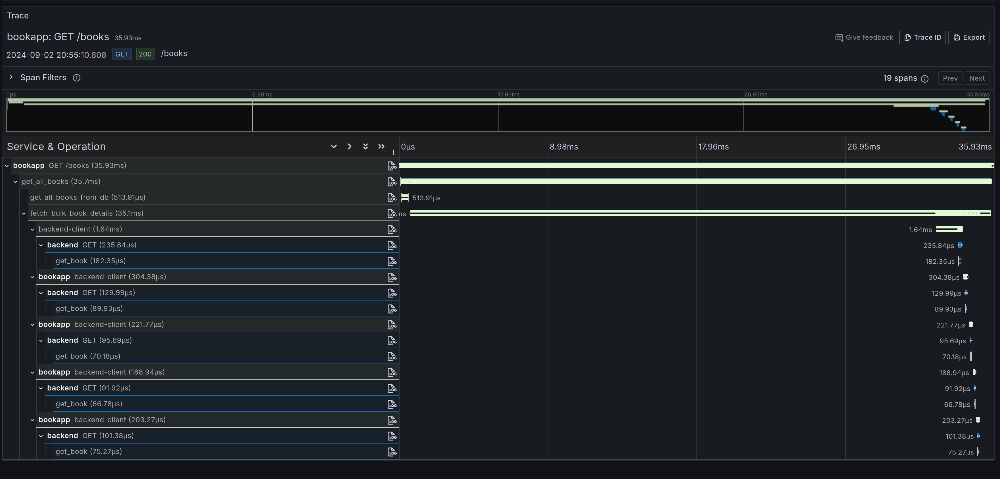

An example of cross service telemetry in Rust using OpenTelemetry.


### Tracing

The **tracing** crate is used to instrument the application code. 

Demonstrates propagation of trace context across `reqwest` calls,
a generated progenitor client and kafka messages.

In the case of kafka we create a linked span rather than continuing the parent span. 

The `tracing-opentelemetry` crate exposes a `tracing` subscriber that exports the traces 
to the **OpenTelemetry Collector** using `opentelemetry-otlp`.

**Span metrics** are calculated from the trace data using the otel collector along with exemplars.

Visualized natively in Grafana:


### Logs

Log events are both shown on the console and exported to the **OpenTelemetry Collector** using
the `OpenTelemetryTracingBridge` - these can be viewed in Loki.


### Metrics

In application metrics are implemented via opentelemetry meter including for http requests
via a fork of `axum-otel-metrics`. The otel collector also collects metrics from postgresql and 
kafka exporting them all to Prometheus.


## Running locally

```shell
docker compose build
docker compose up
```


```.http request
GET http://localhost:8000/books
Accept: application/json

```

Open Grafana at localhost:3000 and login with `admin:admin`




## Load Testing

```shell
uvx \
  --with 'opentelemetry-sdk' \
  --with "opentelemetry-exporter-otlp-proto-grpc >=1.24.0" \
  --with "opentelemetry-instrumentation-requests==0.46b0" \
  --with "opentelemetry-instrumentation-urllib3==0.46b0" \
  locust -f requests/locustfile.py
```


## Migrations

Migrations are run automatically by the bookapp container, or can manually be run using `sqlx-cli`:

```shell
docker compose up -d db
cargo install sqlx-cli
sqlx migrate run
sqlx migrate add <new migration>
```

